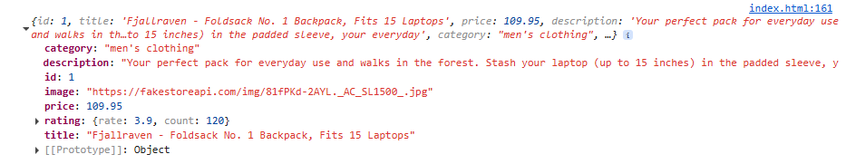

# Récupérer l'API en JavaScript
L'API Fetch est une interface JavaScript moderne qui permet d'effectuer des requêtes HTTP. Elle utilise des promesses, facilitant ainsi le traitement des données asynchrones.

### Syntaxe 

```js
fetch(url, options)
    .then(response => response.json())
    .then(data => console.log(data))
    .catch(error => console.error('Error:', error));
```

* url: le point de terminaison de l'API à partir duquel les données sont récupérées.
* options (facultatif): spécifie la méthode, les en-têtes, le corps, etc.
* response.json(): analyse la réponse au format JSON.
* .catch(error): gère toutes les erreurs qui se produisent pendant la requête.

### Exemple de récupération

```js
fetch('https://fakestoreapi.com/products/1')
.then(response => response.json())
.then(data => console.log(data))
.catch(error => console.error('Error', error));
```



### Gestion des codes d'état de réponse

```js
fetch('https://fakestoreapi.com/product/1')
.then(response => {
    if(response.ok) {
        return response.json();
    } else {
        throw new Error('Réponse réseau non correcte');
    }
})
.then(data => console.log(data))
.catch(error => console.error("Une erreur s'est produite lors de la récupération de données :", error));
```

* **fetch()** : lance une requête réseau vers l'URL fournie.
* **response.ok** : vérifie si l'état de la réponse HTTP est compris entre 200 et 299, indiquant une réussite.
* **return response.json()** : Si la réponse est réussie, les données sont analysées au format JSON pour une utilisation ultérieure.
* **throw new Error()** : Si le code d'état indique une erreur (par exemple, 404 ou 500), une erreur est générée pour la gérer.
* **catch(error)** : détecte toutes les erreurs (problèmes de réseau ou HTTP) et les enregistre dans la console pour le débogage.

### Utilisation de async/await avec l'API Fetch
L'utilisation d'async/await rend la gestion du code asynchrone comme fetch plus propre et plus lisible. Elle permet d'écrire du code qui semble synchrone tout en étant non bloquant.

```js
async function getP(){
    try {
        const response = await fetch('https://fakestoreapi.com/products');
        if(response.ok){
            const data = await response.json();
            console.log(data);
        } else {
            throw new Error('Erreur lors de la récupération.');
        }
    } catch (error){
        console.error('Error', error);
    }
}
getP();
```

### Gestion des différentes méthodes de requête (POST, PUT, DELETE)

#### 1.  GET pour récupérer des données

#### 2.  POST pour la soumission de données

```js
const data = {name: 'HighFive', age: 3};
fetch('https://fakestoreapi.com/products', {
    method: 'POST',
    headers: {'Content-Type': 'application/json'},
    body: JSON.stringify(data)
})
    .then(response => reponse.json())
    .then(result => console.log(result))
    .catch(error => console.error("Une erreur s'est produite:", error))
```

#### 3.  PUT pour la mise à jour des données

```js
const updatedData = { id: 1, price: 300 };

fetch('https://fakestoreapi.com/products/1', {
    method: 'PUT',
    headers: { 'Content-Type': 'application/json' },
    body: JSON.stringify(updatedData)
})
    .then(response => response.json())
    .then(result => console.log(result));

```

#### 4.  DELETE demande de suppression de données

```js
fetch('https://fakestoreapi.com/products/1', {
    method: 'DELETE'
  })
    .then(response => response.json())
    .then(result => console.log('Deleted:', result));
  


```