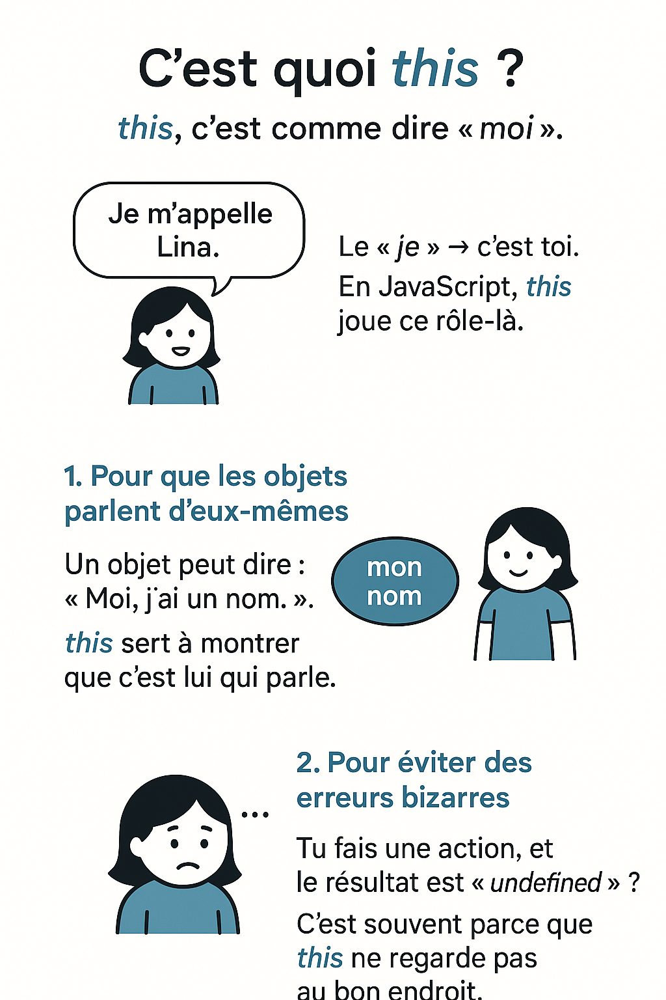
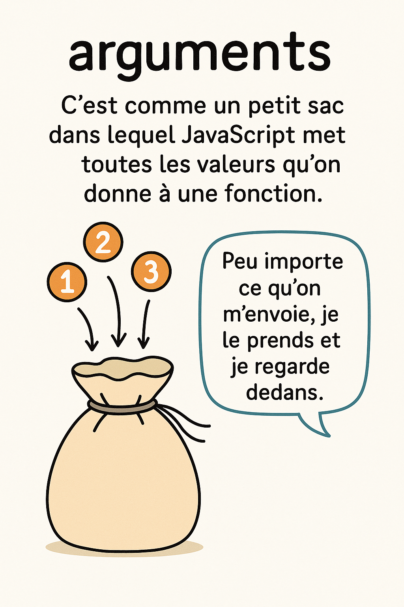
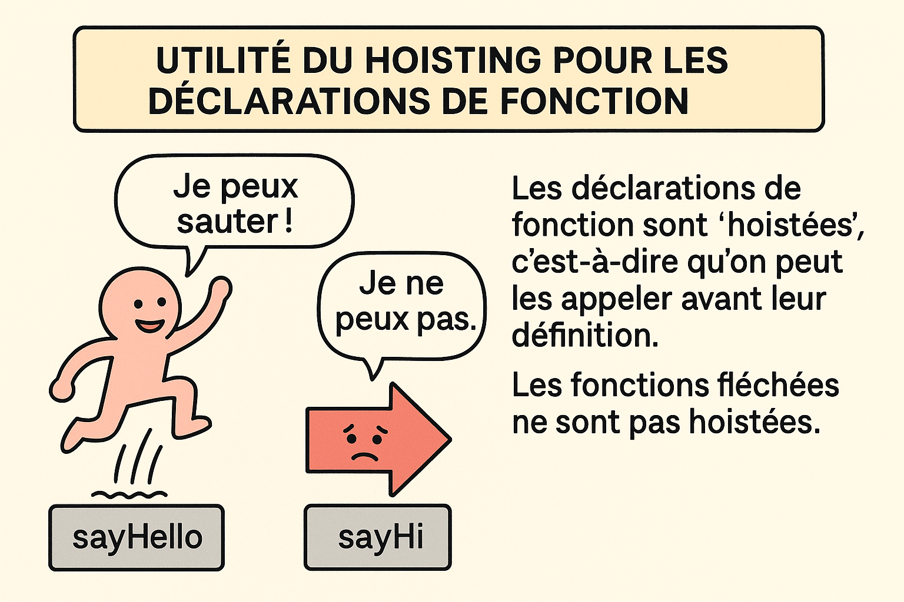

# Fonctions en JavaScript

JavaScript propose plusieurs façons de définir des fonctions. Parmi les plus courantes, on retrouve :

* Les fonctions classiques (function declarations / function expressions)
* Les fonctions fléchées (arrow functions) introduites avec ES6 (ECMAScript 2015)

Même si elles semblent proches, elles présentent des différences importantes qui peuvent avoir un impact majeur sur le comportement de votre code. En nous servant d'un fichier `index.html`, voyons ensemble les quelques points caractéristiques de ces fonctions. 

```html
<!DOCTYPE html>
<html lang="fr">

<head>
  <meta charset="UTF-8">
  <title>Différences Fonctions Classiques vs Fléchées</title>
  <style>
    body {
      font-family: sans-serif;
      padding: 30px;
      background: #fefefe;
    }

    h2 {
      color: #333;
    }

    section {
      margin-bottom: 25px;
    }

    button {
      margin: 10px 0;
      padding: 8px 16px;
      border-radius: 6px;
      border: none;
      background: #007BFF;
      color: white;
      cursor: pointer;
    }

    button:hover {
      background: #0056b3;
    }

    pre {
      background: #f4f4f4;
      padding: 15px;
      border-radius: 8px;
      font-size: 14px;
      white-space: pre-wrap;
    }
  </style>
</head>

<body>
  <h1> Fonctions Classiques vs Fonctions Fléchées</h1>
</body>
</html>
```

### I. Syntaxe

```html
<section>
   <h2>1️⃣ Syntaxe concise</h2>
    <p>Comparer les deux syntaxes pour une même logique.</p>
    <button onclick="testSyntax()">Tester</button>
    <pre id="syntaxOutput"></pre>
</section>
```

✅ Logique que doit contenir la fonction `testSyntax()` :

1. Accéder à la zone où afficher le résultat
2. Vider cette zone pour partir sur du propre
3. Définir une fonction classique qui fait une addition `function additionClassique(){...}`
4. Définir une fonction fléchée qui fait la même addition `const additionFlechee`
5. Appeler la fonction classique avec des valeurs (2 et 3)
6. Afficher le résultat de cette fonction
7. Appeler la fonction fléchée avec les mêmes valeurs
8. Afficher son résultat juste après

Les *fonctions fléchées* sont plus concises et particulièrement utiles pour des fonctions courtes ou en tant que callbacks.

```js
function testSyntax(){
  const output = document.getElementById("syntaxOutput");
  output.textContent = "";

  function additionClassique(a, b) {
    return a + b;
  }

  const additionFlechee = (a, b) => a + b;

  output.textContent += `Classique: 2 + 3 = ${additionClassique(2,3)}\n`;
  output.textContent += `Fléchée: 2 + 3 = ${additionFlechee(2, 3)}`;
}
```

### II. Contexte de `this`

```html
<section>
  <h2>2️⃣ Contexte de <code>this</code></h2>
  <p>Observe comment <code>this</code> se comporte différemment.</p>
  <button onclick="testThis()">Tester</button>
  <pre id="thisOutput"></pre>
</section>
```
✅ Logique que doit contenir la fonction `testThis()` :

1. Accéder à la zone d'affichage du résultat (`thisOutput`)
2. Effacer le contenu déjà présent dans cette zone
3. Créer un objet contenant une propriété name `const obj = {name...}` ayant pour valeur `MonObjet`
4. Ajouter une méthode classique à cet objet `const obj = {..., classic: function(){return `Classique: this.name = ${this.name}`;}}`
5. Ajouter une méthode fléchée à ce même objet `const obj = {..., arrow: () => {return `Fléchée: this.name = ${this.name}`;}}`
6. Appeler la méthode classique de l'objet
7. Afficher le résultat retourné par cette méthode
8. Appeler la méthode fléchée de l'objet
9. Afficher le résultat retourné par cette méthode aussi

```js
function testThis(){
  const output = document.getElementById("thisOutput");
  output.textContent = '';

  const obj = {
    name: 'MonObjet',
    classic: function() {
      return `Classique: this.name = ${this.name}`;
    },
    arrow: () => {
      return `Fléchée: this.name = ${this.name}`;
    }
  }

  output.textContent += obj.classic() + '\n';
  output.textContent += obj.arrow();
}
```

#### ✅ Pourquoi c’est important ?
##### 1. Pour que les objets parlent d’eux-mêmes
Un objet peut dire : “Moi, j’ai un nom.”
`this` sert à montrer que c’est lui qui parle.

##### 2. Pour que le bon contexte soit gardé
Parfois, une fonction est appelée dans un autre endroit.
Sans `this`, elle ne sait plus “qui elle est”.
Tu risques donc d’avoir des résultats faux ou vides.

##### 3. Pour éviter des erreurs bizarres
Tu fais une action, et le résultat est “undefined” ?
➡️ C’est souvent parce que `this` ne regarde pas au bon endroit.

##### 4. Pour bien choisir le bon type de fonction
Les fonctions fléchées ne regardent pas “elles-mêmes”.
Elles utilisent le `this` de l’endroit où elles sont nées.
Du coup, parfois ça marche, parfois non.



#### Exercices de compréhension 

##### Exercice 1
Ici, la fonction `makeUser` renvoie un objet.

Quel est le résultat de l’accès à sa ref ? Pourquoi ?

```js 
function makeUser() {
  return {
    name: "John",
    ref: this
  };
}

let user = makeUser();

alert( user.ref.name ); // Quel est le résultat ?
```

##### Exercice 2

Créez un objet `calculator` avec trois méthodes :

* `read()` demande deux valeurs et les enregistre en tant que propriétés d’objet avec les noms a et b respectivement.
* `sum()` renvoie la somme des valeurs sauvegardées.
* `mul()` multiplie les valeurs sauvegardées et renvoie le résultat.

```js
let calculator = {
  // ... votre code ...
};

calculator.read();
alert( calculator.sum() );
alert( calculator.mul() ); 
``` 


### III. Les arguments

```html
<section>
  <h2>3️⃣ Gestion des <code>arguments</code></h2>
  <p>Les fonctions classiques ont <code>arguments</code>, les fléchées non.</p>
  <button onclick="testArguments()">Tester</button>
  <pre id="argsOutput"></pre>
</section>
```

✅ Étapes de la fonction `testArguments()` :

1. Accéder à la zone d'affichage des résultats (`argsOutput`)
2. Effacer le contenu existant
3. Définir une fonction classique qui utilise arguments `function classique(){return `Classique: arguments = [${[...arguments]}]`}`
4. Définir une fonction fléchée qui tente d’utiliser arguments `const flechee = (...args) => {...}` <!--utilisons un try/catch au cas où, on ne sait jamais-->
5. Appeler la fonction classique avec une valeur
6. Afficher ce que la fonction classique retourne
7. Appeler la fonction fléchée avec une valeur
8. Afficher ce que la fonction fléchée retourne

```js
function testArguments(){
  const output = document.getElementById("argsOutput");
  output.textContent = "";

  function classique() {
    return `Classique: arguments = [${[...arguments]}]`;
  }

  const flechee = (...args) => {
    try {
      return `Fléchée: arguments = ${arguments}`;
    } catch {
      return `Fléchée: 'arguments' n'existe pas, mais on a args = [${args}]`;
    }
  }

  output.textContent += classique(1, 2, 3) + '\n';
  output.textContent += flechee(4, 5, 6);
}
```



### IV. Le constructeur

```html
<section>
  <h2>4️⃣ Constructeur avec <code>new</code></h2>
  <p>Peut-on instancier une fonction avec <code>new</code> ?</p>
  <button onclick="testConstructor()">Tester</button>
  <pre id="constructorOutput"></pre>
</section>
```

✅ Étapes de la fonction `testConstructeur()` :

1. Accéder à la zone d'affichage des résultats (`constructOutput`)
2. Vider le contenu précédent
3. Définir une fonction classique utilisable avec new `function PersonClassic(name){this.name = name}`
4. Définir une fonction fléchée qui tente d’être utilisée avec new `const PersonArrow = (name) => {this.name = name;}`
5. Créer un objet avec la fonction classique (via new)
6. Afficher le nom récupéré avec la fonction classique
7. Essayer de créer un objet avec la fonction fléchée
8. Afficher le résultat ou une erreur si ça échoue

```js
function testConstructor() {
  const output = document.getElementById('constructorOutput');
  output.textContent = '';

  function PersonClassic(name) {
    this.name = name;
  }

  const PersonArrow = (name) => {
    this.name = name;
  }

  try {
    const p1 = new PersonClassic("Alice");
    output.textContent += `Classique: p1.name = ${p1.name}\n`;
  } catch (e) {
    output.textContent += `Classique: Erreur - ${e.message}\n`;
  }

  try {
    const p2 = new PersonArrow("Bob");
    output.textContent += `Fléchée: p2.name = ${p2.name}`;
  } catch (e) {
    output.textContent += `Fléchée: Erreur - ${e.message}`;
  }
}
```

Une fonction constructeur sert à créer plusieurs objets qui se ressemblent, automatiquement.

Pourquoi utiliser une fonction comme constructeur ?

##### 1. Pour éviter de répéter ton code
Tu ne vas pas recopier 5 fois le même objet à la main.

➡️ Tu crées une seule fonction et tu peux générer autant d’objets que tu veux.

##### 2. Pour automatiser la création
Tu donnes des valeurs à la fonction (nom, âge, etc.) → elle fait tout le travail pour toi.

➡️ Pas besoin de recréer les propriétés une par une.

##### 3. Pour faire des modèles d’objet
C’est comme une formule. Par exemple : un modèle de voiture, un profil utilisateur, un livre…

##### 4. Pour pouvoir utiliser new
Avec new, JavaScript :

crée un nouvel objet vide

appelle ta fonction

ajoute les données

te rend l’objet tout prêt

##### 5. Pour organiser ton code proprement
Tu veux que tout ce qui concerne "une personne" soit au même endroit ?

➡️ Le constructeur te permet de garder tout ça clair et bien structuré.

### V. Le hoisting

```html
<section>
  <h2>5️⃣ Hoisting</h2>
  <p>Quelle fonction peut être appelée avant sa définition ?</p>
  <button onclick="testHoisting()">Tester</button>
  <pre id="hoistingOutput"></pre>
</section>
```

✅ Étapes de la fonction `testHoisting()` :

1. Accéder à la zone d'affichage des résultats (`hoistingOutput`)
2. Vider le contenu précédent
3. Tenter d’appeler une fonction classique avant sa déclaration
* Si l’appel réussit → afficher son résultat
* Si une erreur survient → afficher le message d’erreur
4. Tenter d’appeler une fonction fléchée avant sa déclaration
* Si l’appel réussit → afficher son résultat
* Si une erreur survient → afficher le message d’erreur
5. Définir la fonction classique (qui fonctionne avec hoisting)
6. Définir la fonction fléchée (qui ne fonctionne pas avant sa déclaration)

```js
function testHoisting() {
  const output = document.getElementById('hoistingOutput');
  output.textContent = '';

  try {
    const result = sayHello();
    output.textContent += `Classique hoistée: ${result}\n`;
  } catch (e) {
    output.textContent += `Classique hoistée: Erreur - ${e.message}\n`;
  }

  try {
    const result = sayHi();
    output.textContent += `Fléchée (non hoistée): ${result}`;
  } catch (e) {
    output.textContent += `Fléchée (non hoistée): Erreur - ${e.message}`;
  }

  function sayHello() {
    return "Bonjour depuis une fonction classique.";
  }

  const sayHi = () => "Salut depuis une fonction fléchée.";
}
``` 



### Différentes autres façons de déclarer une fonction en JavaScript

* **Function Expression** (Fonction anonyme assignée à une variable)
```js
const greet = function() {
  return "Salut";
};
```

* **Méthode dans un objet**
```js
const person = {
  speak() {
    return "Je parle !";
  }
};
```

* **Méthode dans une classe**
```js
class Person {
  greet() {
    return "Bonjour !";
  }
}
```

* **Fonction asynchrone** (async function)
```js
async function fetchData() {
  const res = await fetch("/api/data");
  return await res.json();
}
```

* **IIFE – Immediately Invoked Function Expression**
```js
(function() {
  console.log("Exécutée immédiatement !");
})();
```