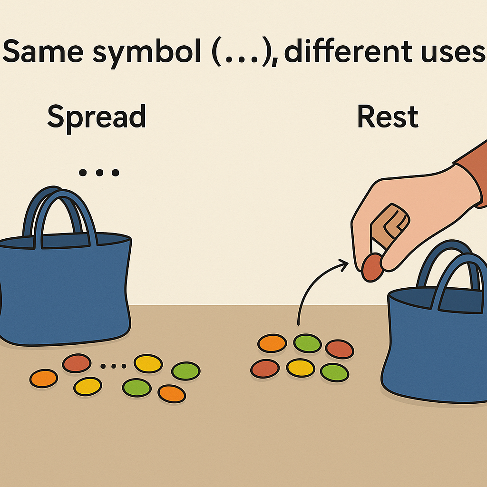

## Opérateur `spread`

L'**opérateur spread** `...` en JavaScript permet d'étendre ou de décomposer des éléments dans des endroits où plusieurs éléments sont attendus, comme dans les appels de fonction, les tableaux, ou les objets. Voici quelques exemples de son utilisation :  
* **Appels de fonction** : Utilisation de l'opérateur spread pour passer les éléments d'un tableau comme arguments d'une fonction.
```js
function additionner(a, b, c) {
    return a + b + c;
}

const nombres = [1, 2, 3];
console.log(additionner(...nombres)); // Affiche 6
```  
Dans cet exemple, l'opérateur spread `...nombres` décompose le tableau nombres en trois arguments distincts pour la fonction additionner.  
* **Combinaison de tableaux** : Utilisation de l'opérateur spread pour combiner plusieurs tableaux en un seul.  
```js
const tableau1 = [1, 2, 3];
const tableau2 = [4, 5, 6];
const tableauCombine = [...tableau1, ...tableau2];
console.log(tableauCombine); // Affiche [1, 2, 3, 4, 5, 6]
```  
Dans cet exemple, l'opérateur spread est utilisé pour décomposer les éléments de `tableau1` et `tableau2` et les combiner en un seul tableau `tableauCombine`.
* **Copie de tableaux** : Utilisation de l'opérateur spread pour créer une copie superficielle d'un tableau.  
```js
const arrSpr = ["JAN",'fEB','MAR','APR','MAY'];
let arrSpr2 ;

(function(){
    // arrSpr2 = arrSpr;
    arrSpr2 =[...arrSpr]; //je suis entrain de faire une copie du premier tableau
    arrSpr[0]="potato"
})();

console.log(arrSpr2); 
```  
* **Décomposition d'objets**: Utilisation de l'opérateur spread pour copier les propriétés d'un objet dans un autre.  
```js
const objet1 = { a: 1, b: 2 };
const objet2 = { c: 3, d: 4 };
const objetCombine = { ...objet1, ...objet2 };
console.log(objetCombine); // Affiche { a: 1, b: 2, c: 3, d: 4 }
```  
Dans cet exemple, l'opérateur spread est utilisé pour décomposer les propriétés de `objet1` et `objet2` et les combiner en un seul objet `objetCombine`.

* **Ajout de propriétés à un objet**: Utilisation de l'opérateur spread pour ajouter de nouvelles propriétés à un objet existant.  
```js
const personne = { nom: 'Alice', age: 25 };
const personneAvecVille = { ...personne, ville: 'Paris' };
console.log(personneAvecVille); // Affiche { nom: 'Alice', age: 25, ville: 'Paris' }
```  
Dans cet exemple, l'opérateur spread est utilisé pour copier les propriétés de l'objet `personne` et ajouter une nouvelle propriété `ville`.  
L'opérateur spread est très utile pour travailler avec des collections de données en JavaScript, rendant le code plus concis et plus lisible.

## Opérateur `rest`
L'opérateur rest `(...)` en JavaScript permet de représenter un nombre indéfini d'arguments sous forme de tableau. Il est particulièrement utile dans les fonctions lorsque vous ne savez pas combien d'arguments seront passés. Voici comment il fonctionne :  

* **Fonctions** : Utilisation de l'opérateur `rest` `...nombres` pour collecter tous les arguments supplémentaires dans un tableau.
```js
function additionner(...nombres) {
    return nombres.reduce((total, nombre) => total + nombre, 0);
}

console.log(additionner(1, 2, 3)); // Affiche 6
console.log(additionner(4, 5, 6, 7)); // Affiche 22
```  

* **Décomposition d'objets** : Utilisation de l'opérateur rest pour extraire des propriétés restantes d'un objet.

```js
const personne = {
    nom: 'Alice',
    age: 25,
    ville: 'Paris'
};

const { nom, ...details } = personne;
console.log(nom); // Affiche 'Alice'
console.log(details); // Affiche { age: 25, ville: 'Paris' }
```
Dans cet exemple, l'opérateur `rest` `...details` est utilisé pour extraire les propriétés restantes de l'objet personne après avoir extrait la propriété nom.  
* **Décomposition de tableaux** : Utilisation de l'opérateur `rest` pour capturer les éléments restants d'un tableau.
```js
const [premier, ...restants] = [1, 2, 3, 4, 5];
console.log(premier); // Affiche 1
console.log(restants); // Affiche [2, 3, 4, 5]j'a
```

L'opérateur `rest` est un outil puissant qui facilite le travail avec des listes d'arguments variables et la décomposition d'objets ou de tableaux en JavaScript.


