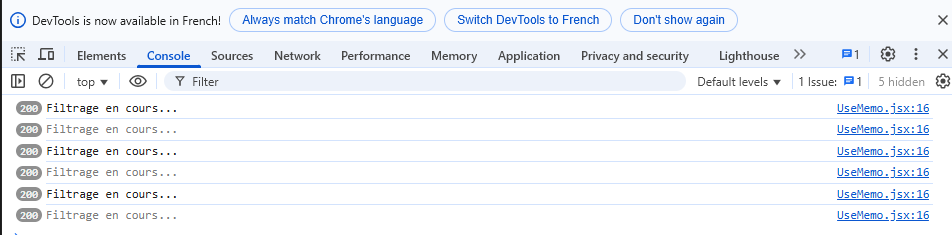

## `useMemo` ou Le mémoïsage de valeurs

🔍 À quoi sert `useMemo` ?
`useMemo` sert à mémoriser une valeur qui est coûteuse à **recalculer**, ou **inutile à recalculer** à *chaque re-render*.

➡️ Il évite que cette valeur soit recalculée si *ses dépendances* ne changent pas.

📦 Syntaxe

```jsx
const memoizedValue = useMemo(() => computeSomething(), [dependency1, dependency2]);
```

| Situation                                              | Pourquoi `useMemo` ?                            |
| ------------------------------------------------------ | ----------------------------------------------- |
| Calcul intensif (ex: gros filtre, tri, somme)          | Évite de recalculer inutilement à chaque render |
| Dépendance à une variable stable                       | Ne change que quand la variable change          |
| Passer une valeur stable à un composant enfant (props) | Évite des re-renders inutiles                   |

📌 Exemple (nous allons créer un nouveau composant `UseMemo` qui sera rendu par `App`)

🎯 Objectif
  * Tu as une liste d’utilisateurs très longue

  * Tu peux filtrer cette liste en tapant dans un champ

  * Tu peux aussi cliquer sur un compteur qui n’a rien à voir avec le filtre

```jsx
function FilterList() {
  const [count, setCount] = React.useState(0);
  const [query, setQuery] = React.useState("");

  const users = Array.from({ length: 200 }, (_, i) => `Utilisateur ${i + 1}`);

  const filteredUsers = users.filter((user) =>
    {
        console.log("Filtrage optimisé exécuté !");
        return user.toLowerCase().includes(query.toLowerCase());
    }
  );

  return (
    <div>
      <h3>Filtrer une grande liste</h3>
      <input
        type="text"
        value={query}
        placeholder="Rechercher un utilisateur"
        onChange={(e) => setQuery(e.target.value)}
      />
      <button onClick={() => setCount((c) => c + 1)}>Incrémenter : {count}</button>
      <ul>
        {filteredUsers.slice(0, 20).map((user) => (
          <li key={user}>{user}</li>
        ))}
      </ul>
    </div>
  );
}

``` 

A chaque clique sur le bouton `Incrémenter`, notre fonction `filteredUsers` est exécutée. 



En faisant appel à `useMemo`, notre application devient plus performante.

```jsx
const filteredUsers = React.useMemo(() => {
console.log("Filtrage optimisé exécuté !");
return users.filter((user) =>
    user.toLowerCase().includes(query.toLowerCase())
);
}, [query]);
```

Comparatif rapide useMemo vs `useEffect`

| 🔍 Critère | `useMemo` | `useEffect` |
|------------|-----------|-------------|
| 📦 Sert à… | Mémoriser une **valeur** | Réagir à un **effet de bord** (API, événement DOM) |
| 🔁 Dépendances | Oui (`[deps]`) | Oui (`[deps]`) |
| ⚙️ Utilisation | Renvoyer un résultat directement | Exécuter du code (logique, fetch, DOM) |
| 🔄 Appelé quand ? | Quand une dépendance change (retourne la valeur) | Quand une dépendance change (exécute le code) |
| ⛔ Mauvais usage | Fetch API, console.log, DOM manipulation | Calcul intensif, filtre de tableau |

En résumé :

| Tu veux… | Tu utilises… |
|----------|--------------|
| Une **valeur à calculer** (tri, somme, format) | ✅ `useMemo` |
| Réagir à un **changement d’état** avec un effet (fetch, DOM, event) | ✅ `useEffect` |


## `React.memo` ou Le mémoïsage d’un composant

✅ À quoi sert React.memo ?

`React.memo` est une **fonction HOC** (Higher-Order Component) qui permet de **mémoriser un composant fonctionnel**.

🔁 Ce qu’il fait

  * Il **compare les props** du composant enfant

  * Si les props **n’ont pas changé**, il **empêche le re-render**

  * ⚠️ La comparaison est **shallow** (superficielle)

Syntaxe
```jsx
const Child = React.memo(function Child(props) {
  // ...
});
```

ou bien :

```jsx
const Child = (props) => { ... }
export default React.memo(Child);
```

🎯 Exemple clair

Sans `React.memo` :

```jsx
function Parent() {
  const [count, setCount] = useState(0);
  return (
    <>
      <button onClick={() => setCount(count + 1)}>+1</button>
      <Child name="Jean" />
    </>
  );
}

function Child({ name }) {
  console.log("Rendered Child");
  return <p>Nom : {name}</p>;
}

```

✅ Avec React.memo :

```jsx
const Child = React.memo(function Child({ name }) {
  console.log("Rendered Child");
  return <p>Nom : {name}</p>;
});
```
✅ Maintenant :

* `Child` **ne se re-render** plus si `name` ne change pas

* Même si `Parent` se re-render (ex: via `count`)

✅ On va intégrer `React.memo` sur le composant `Display`.

🎯 Objectif

Empêcher le re-render de `Display` si ses `props` ne changent pas :

  * saisie

  * operator

  * secondValue

  * result

* Petit test : 

```jsx
export default function Display({ saisie, operator, secondValue, result }) {
  console.log("composant Display");
  // Rest du code
}
```

Comme nous pouvons le constater, le composant `Display`  est re-rendu de manière constante à cause du timer.

Solution 1 : l'entourer avec `React.memo`

```jsx
const Display = React.memo(function Display({ saisie, operator, secondValue, result }) {
  return (
    <div className={`${styles.display} ${styles.flexElement}`}>
      <span>{!saisie ? 0 : saisie}</span>
      <span>{operator}</span>
      <span>{!secondValue ? 0 : secondValue}</span>
      <span className={styles.result}>{result ?? 0}</span>
    </div>
  );
});

export default Display;

```

Solution 2 : export directement mémoïsé

```jsx
function Display({ saisie, operator, secondValue, result }) {
  return (
    <div className={`${styles.display} ${styles.flexElement}`}>
      <span>{!saisie ? 0 : saisie}</span>
      <span>{operator}</span>
      <span>{!secondValue ? 0 : secondValue}</span>
      <span className={styles.result}>{result ?? 0}</span>
    </div>
  );
}

export default React.memo(Display);
```

Le résultat parle de lui-même ! 

