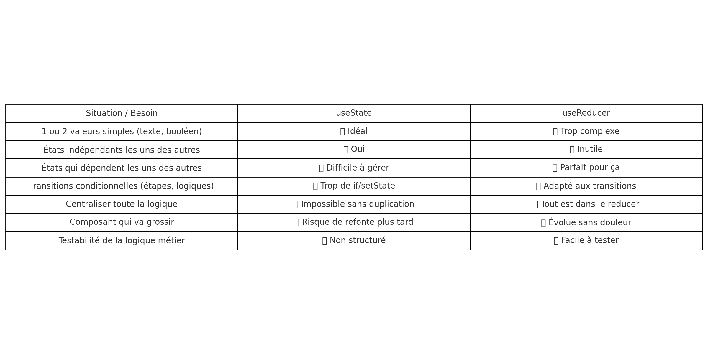

## useReducer

En React, un `reducer` est une fonction qui gère l'état d'un composant ou d'une application en fonction des actions reçues. Il est souvent utilisé avec le hook `useReducer` pour gérer des états complexes. 
Voici un aperçu de son utilisation :

**Structure d'un Reducer**
Un `reducer` est une fonction qui prend deux arguments :

 1. **État précédent** : L'état actuel que vous souhaitez mettre à jour.
 2. **Action** : Un objet qui décrit le type d'action à effectuer et éventuellement des données supplémentaires.
  
*La fonction retourne un nouvel état.*  


```jsx
const initialState = { count: 0 };

function reducer(state, action) {
  switch (action.type) {
    case 'increment':
      return { count: state.count + 1 };
    case 'decrement':
      return { count: state.count - 1 };
    default:
      return state;
  }
}

const [state, dispatch] = useReducer(reducer, initialState);
```

   * `state` : l’état actuel (objet, tableau, etc.)

   * `dispatch(action)` : une fonction pour envoyer une action

   * `reducer(state, action)` : une fonction qui reçoit l’action et retourne un nouvel état

   * `initialState` : l’état initial du composant

```jsx
<p>{state.count}</p>


<button onClick={() => dispatch({ type: 'increment' })}>+</button>
```

* Cas pratique avec notre calucltrice

Objectif de cette étape : **remplacer tous les `useState` liés au calcul** (saisie, secondValue, operator, result, error) par `useReducer`. 

✅ Étape 1 — Définir l’état initial

Dans `Calculator.jsx`, au tout début, ajoute :

```jsx
const initialState = {
  saisie: null,
  secondValue: null,
  operator: null,
  result: null,
  errorMessage: ""
};
```

✅ Étape 2 — Créer la fonction `calculatorReducer`

Juste en dessous, ajoute :

```jsx
function calculatorReducer(state, action) {
  switch (action.type) {
    case 'ADD_DIGIT':
      if (!state.operator) {
        if (state.saisie?.length >= 10) return state;
        return {
          ...state,
          saisie: (state.saisie || "") + action.payload
        };
      } else {
        if (state.secondValue?.length >= 10) return state;
        return {
          ...state,
          secondValue: (state.secondValue || "") + action.payload
        };
      }

    case 'SET_OPERATOR':
      return { ...state, operator: action.payload };

    case 'CLEAR':
      return initialState;

    case 'SET_RESULT':
      return { ...state, result: action.payload };

    case 'SET_ERROR':
      return { ...state, errorMessage: action.payload };

    default:
      return state;
  }
}

```

Ce reducer va gérer toute la logique métier : ajout de chiffres, opérateurs, résultat, etc.

✅ Étape 3 — Utiliser useReducer dans ton composant

Remplace les anciens `useState` :

```jsx
// ❌ à supprimer
// const [saisie, setSaisie] = useState(null);
// const [secondValue, setSecondValue] = useState(null);
// const [operator, setOperator] = useState(null);
// const [result, setResult] = useState(null);
// const [errorMessage, setErrorMessage] = useState("");

const [state, dispatch] = React.useReducer(calculatorReducer, initialState);

```

✅ Tu peux maintenant accéder à :

   * state.saisie

   * state.operator

   * state.secondValue

   * state.result

   * state.errorMessage

Il faudra aller étape par étape pour remplacer les setters utilisés précédemment par `dispatch`

🎯 Quand utiliser `useState` vs `useReducer`

| Critère / Situation | ✅ **useState** | ✅ **useReducer** |
|:--|:--|:--|
| 📦 Tu gères **1 ou 2 valeurs simples** (ex: booléens, texte, nombre) | ✅ Oui | ❌ Inutile |
| 🧩 Tu as **plusieurs états** indépendants et simples | ✅ Oui | ❌ Pas nécessaire |
| 🔗 Tu as **plusieurs états qui dépendent les uns des autres** | ❌ Difficile | ✅ Idéal |
| 🔁 Tu as **des transitions de logique** (ex: étapes, scénarios) | ❌ Trop de `if` | ✅ Parfait |
| 🧠 Tu veux **garder la logique centralisée** | ❌ Impossible | ✅ `reducer()` clair |
| 🔍 Tu veux **tester ou simuler les effets d’une action** | ❌ Complexe | ✅ Facile à tester |
| 🧱 Tu veux faire **grandir ton composant dans le temps** | ❌ Faible évolutivité | ✅ Facile à faire évoluer |




## props.children

En React, props.children représente **le contenu qu’on place à l’intérieur d’un composant** lors de son utilisation.

C’est ce qui permet à un composant d’être "**conteneur**" ou "**wrapper**".

Exemple simple

Composant :

```jsx
function Boite(props) {
  return (
    <div className="boite">
      <h2>Contenu :</h2>
      <div>{props.children}</div>  {/* ← ici le contenu passe */}
    </div>
  );
}
```

Utilisation :

```jsx
<Boite>
  <p>Bonjour</p>
  <button>OK</button>
</Boite>

```

Ce que React voit réellement :

```jsx
<div className="boite">
  <h2>Contenu :</h2>
  <div>
    <p>Bonjour</p>
    <button>OK</button>
  </div>
</div>

```